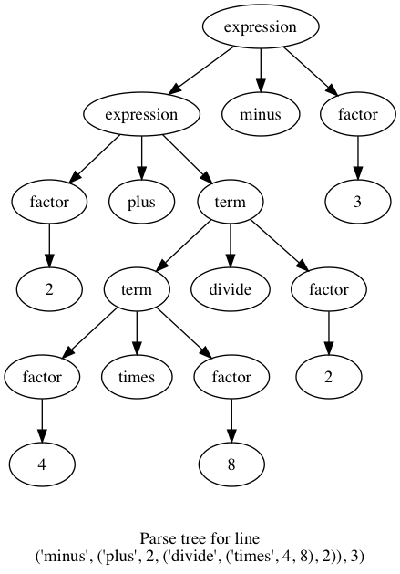

# Parsely lexical and syntactic analyser

Truda G, Toyer Z, Moolla T, Murray J, Sprung B

<p align="center">
	</img>
	</img>
</p>


## Dependencies

To visualise, you need [graphviz](http://graphviz.readthedocs.io/en/stable/manual.html#installation) python library and [graphviz for your OS](http://www.graphviz.org/download/). See requirements.txt for more.

You can still run
```
$python driver.py <file.prsly>
```
even without the dependencies.
